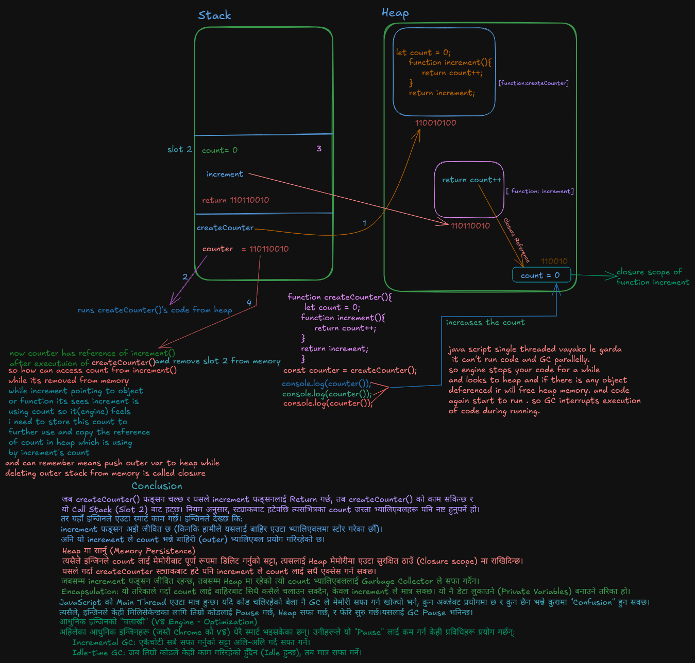

# Closure & Memory Management

This folder contains my deep-dive into JavaScript Closures and how the Engine handles memory between the Stack and Heap.

### Visualization

### Key Learnings:

- **Scope Chain:** How JS looks for variables.
- **Closures:** Functions remembering their lexical environment.
- **Memory:** Why certain variables stay in the Heap even after the function execution is over.
